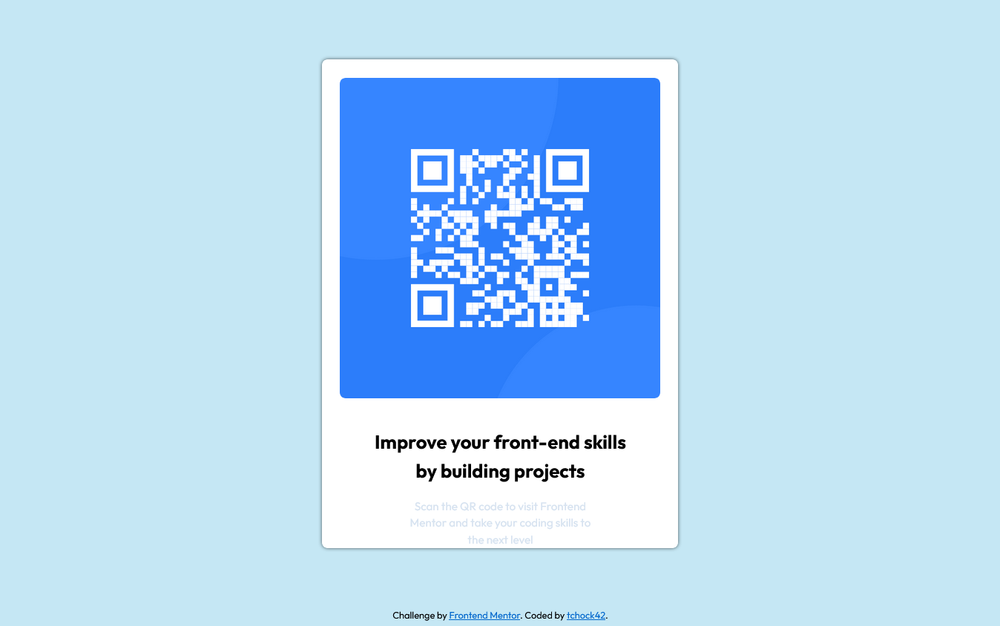

# Frontend Mentor - QR code component solution

This is a solution to the [QR code component challenge on Frontend Mentor](https://www.frontendmentor.io/challenges/qr-code-component-iux_sIO_H). Frontend Mentor challenges help you improve your coding skills by building realistic projects. 

## Table of contents

- [Overview](#overview)
  - [Screenshot](#screenshot)
  - [Links](#links)
- [My process](#my-process)
  - [Built with](#built-with)
  - [What I learned](#what-i-learned)
  - [Continued development](#continued-development)
  - [Useful resources](#useful-resources)
- [Author](#author)
- [Acknowledgments](#acknowledgments)


## Overview

### Screenshot




### Links

- Solution URL: https://github.com/tchock42/QR-CODE-)


## My process
I saw the reference image and made it in Visual studio Code

### Built with

HTML and CSS


### What I learned

```css
img{
    max-width: 90%;
    border-radius: 1rem;
}
.codigo{
    display: block;
    margin: 3rem auto 5rem auto;  
}
```
### Continued development

I need to improve my skills, because i feel that I lasted too time in this project.

### Useful resources

- [mdn web docs](https://developer.mozilla.org/es/docs/Web) - This helped me for display block properties.
- [html color codes](https://htmlcolorcodes.com/es/) - I used this for color codes..


## Author

- Website - [Jacob Gomez Carrillo](https://github.com/tchock42)
- Frontend Mentor - [@tchock42](https://www.frontendmentor.io/profile/tchock42)


## Acknowledgments

I have difficult using padding and margin and with the size of the box outside the image.
